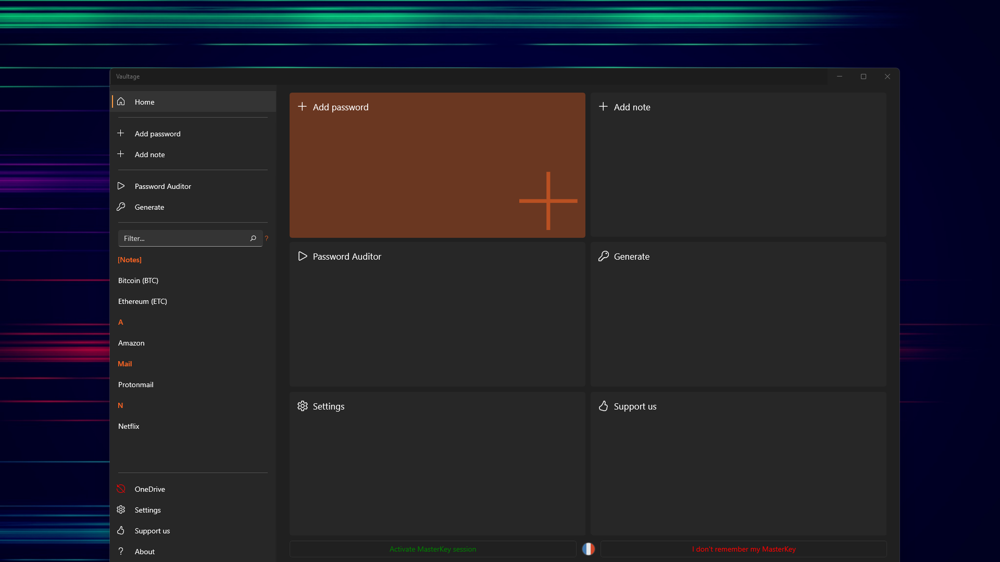
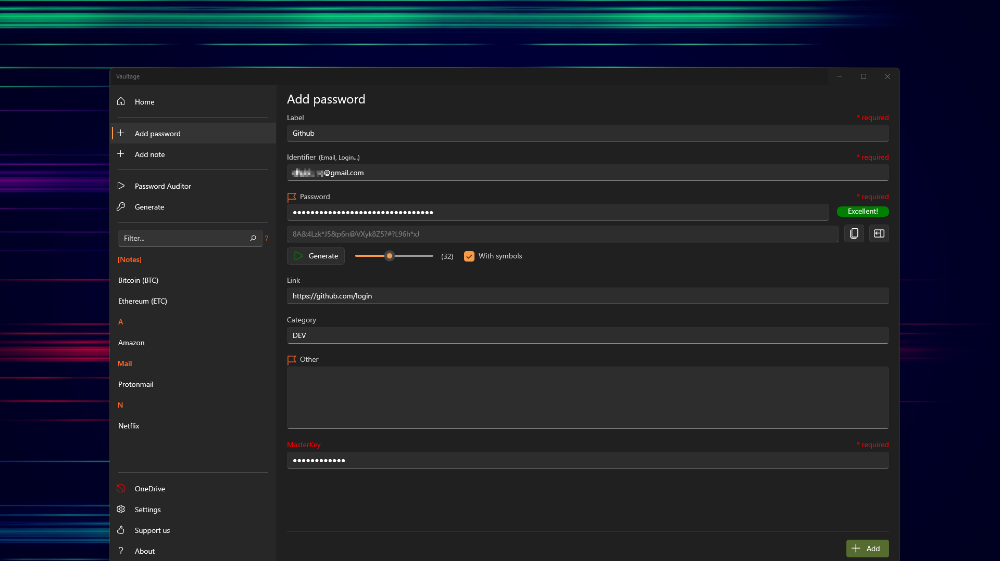
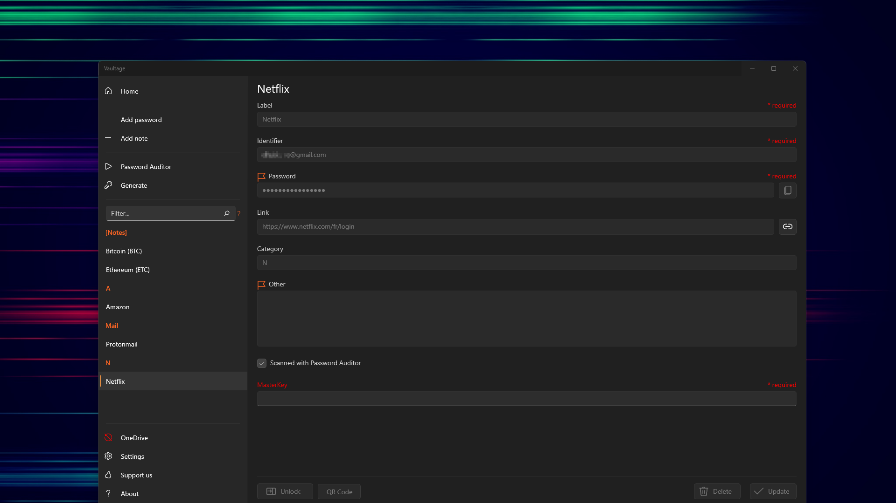
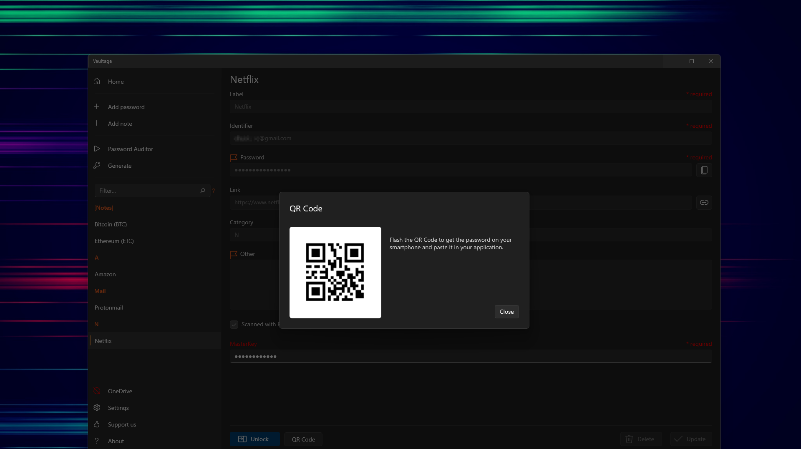
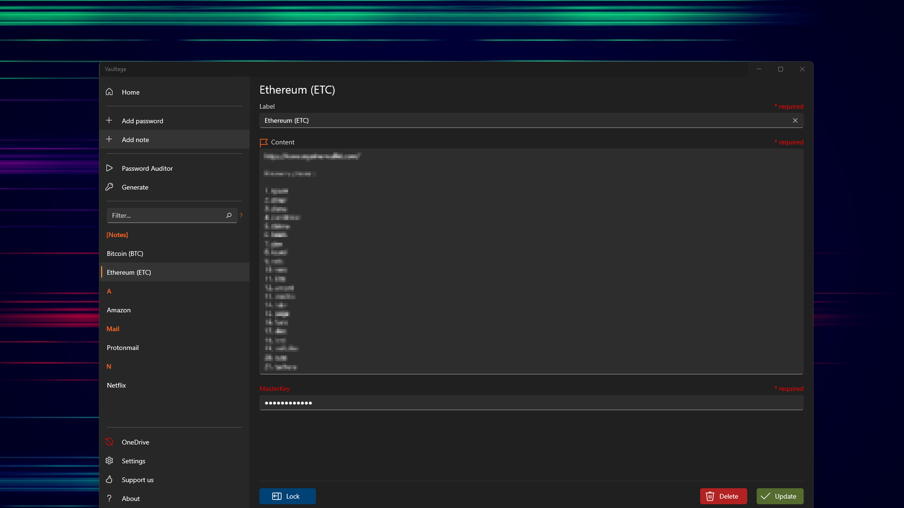
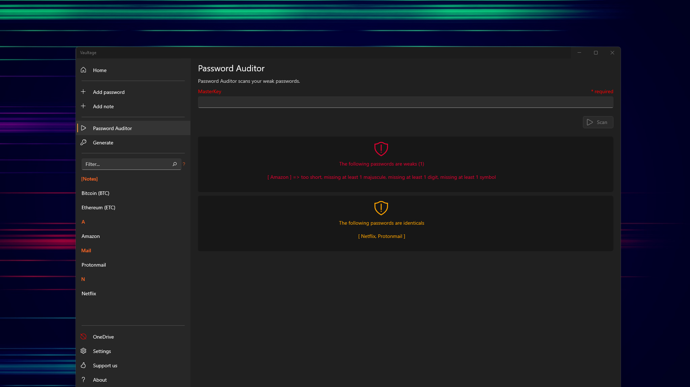
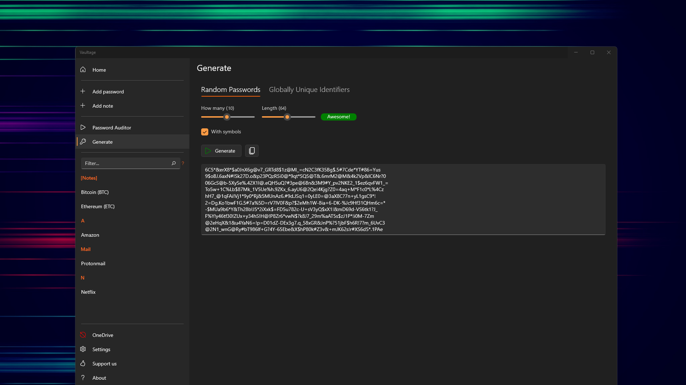
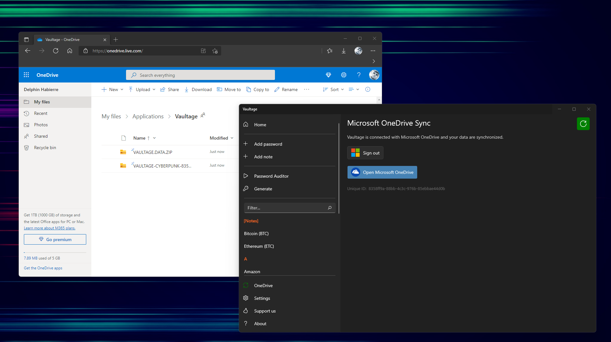

# Vaultage

Vaultage is a Password Manager that help you to manage passwords and other sensitive personal data.

- Save and manage your website passwords
- Save and manage your sensitive notes
- Execute Password Auditor to detect your weak passwords
- Generate strong passwords and GUID
- QR Code support
- Microsoft OneDrive Backup & Sync support

## Downloads

### Windows

The application is available on Microsoft Store

### Mobile

_Work in progress..._

## Feedback

Thank you for using Vaultage!

We're working hard to make the app faster and better than ever.

Love the app? Rate us!

Your feedback is really important, and it helps us to make Vaultage even better =)

## Screenshots

### Home

### Add password

### Edit password

### QR Code

### Edit note

### Password Auditor

### Generate strong passwords

### Microsoft OneDrive Synchronization

Enjoy the app! =)